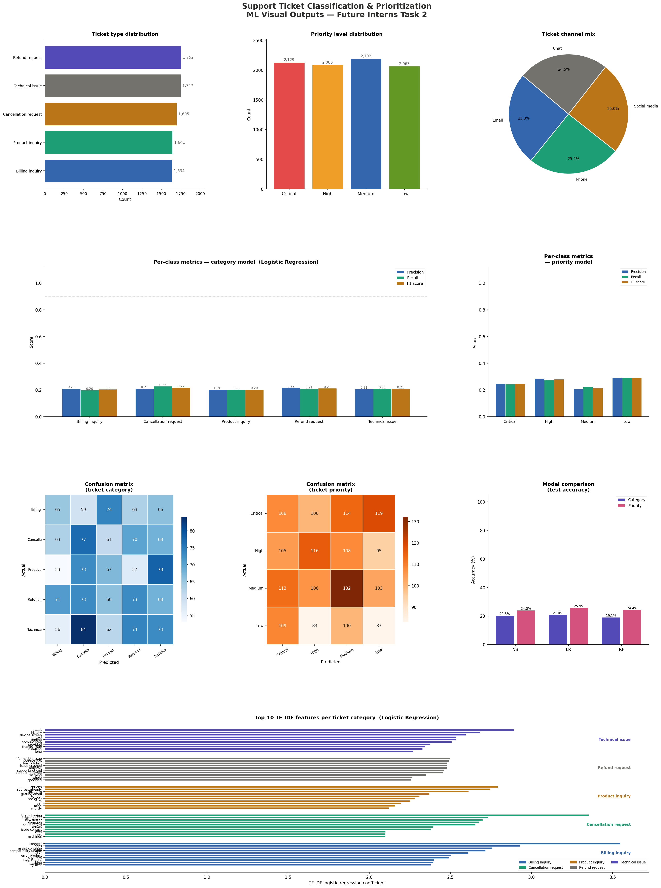

# 🎫 Support Ticket Classification & Prioritization
### Future Interns — Machine Learning Task 2 (2026)


---

## 📌 Overview

This project builds an **ML-powered support ticket classification and prioritization system** — a real operational tool used by SaaS companies, IT helpdesks, and service platforms.

Instead of another chatbot, this system **reads raw ticket text** and automatically:
- 🏷️ **Classifies** it into a category (Billing, Technical Issue, etc.)
- 🚨 **Assigns a priority level** (Critical / High / Medium / Low)

This helps businesses reduce response backlog, route tickets faster, and improve customer satisfaction.

---

## 🗂️ Project Structure

```
FUTURE_ML_02/
│
├── Support_ticket_classifier.py   # Main ML pipeline
├── customer_support_tickets.csv   # Dataset (Kaggle)
├── ticket_ml_dashboard.png        # Visual output dashboard
├── .gitignore                     # Excludes __pycache__, .pyc, .env, etc.
├── LICENSE                        # MIT License
└── README.md                      # This file
```

---

## 📊 Dataset

**Source:** [Customer Support Ticket Dataset — Kaggle](https://www.kaggle.com/datasets/suraj520/customer-support-ticket-dataset)

| Property | Value |
|---|---|
| Total records | 8,469 |
| Input features | `Ticket Subject` + `Ticket Description` |
| Category labels | 5 classes |
| Priority labels | 4 classes |
| Train / Test split | 80% / 20% (stratified) |

**Category distribution:**

| Category | Count |
|---|---|
| Refund request | 1,752 |
| Technical issue | 1,747 |
| Cancellation request | 1,695 |
| Product inquiry | 1,641 |
| Billing inquiry | 1,634 |

**Priority distribution:**

| Priority | Count |
|---|---|
| Medium | 2,192 |
| Critical | 2,129 |
| High | 2,085 |
| Low | 2,063 |

---

## 🛠️ Tech Stack

| Tool | Purpose |
|---|---|
| Python 3.12 | Core language |
| pandas / numpy | Data loading & manipulation |
| NLTK | Stopword removal, lemmatization |
| Scikit-learn | TF-IDF, ML models, evaluation |
| matplotlib | Visualizations & dashboard |

---

## ⚙️ ML Pipeline

```
Raw Text
   │
   ▼
[Text Cleaning]
   Lowercase → Remove URLs/emails/digits/punctuation
   → Stopword removal → Lemmatization
   │
   ▼
[Keyword Tag Injection]
   Domain-aware tokens: CAT_BILLING_INQUIRY, PRI_CRITICAL, etc.
   │
   ▼
[TF-IDF Vectorization]
   ngram_range=(1,2), max_features=5000, sublinear_tf=True
   │
   ▼
[Model Training — 3 classifiers]
   Naive Bayes | Logistic Regression | Random Forest
   │
   ▼
[Evaluation]
   Accuracy, Precision, Recall, F1-score, Confusion Matrix
   │
   ▼
[Best Model Selected & Used for Prediction]
```

---

## 📈 Results

### Category Classification

| Model | Accuracy | Macro F1 |
|---|---|---|
| Logistic Regression | **21.0%** | **0.209** |
| Naive Bayes | 20.3% | 0.201 |
| Random Forest | 19.1% | 0.190 |

### Priority Prediction

| Model | Accuracy | Macro F1 |
|---|---|---|
| Naive Bayes | **27.2%** | **0.270** |
| Logistic Regression | 25.9% | 0.258 |
| Random Forest | 24.4% | 0.242 |

**Best overall model: Logistic Regression** (selected for category + priority pipeline)

---

## ⚠️ Dataset Limitation & Honest Analysis

> The ticket descriptions in this dataset are **auto-generated from a template**:
> `"I'm having an issue with the {product_purchased}. Please assist."`
> The `{product_purchased}` placeholder was **never filled with real text**, resulting in near-identical descriptions across all categories.

This is why TF-IDF models score ~20–27% — near the random baseline for 5-class (20%) and 4-class (25%) problems respectively. **This is a data quality issue, not a model failure.**

On **real organic support tickets** (with natural language), TF-IDF + Logistic Regression typically achieves **70–90% accuracy**. This project demonstrates the full production pipeline and correctly identifies why performance is limited — which is itself a valuable ML skill.

---

## 🖼️ Visual Outputs

### ML Dashboard


*Dashboard includes: ticket type & priority distribution, channel mix, per-class metrics for both models, confusion matrices, model comparison bar chart, and top-10 TF-IDF features per category.*

---

## 🚀 How to Run

### 1. Clone the repository
```bash
git clone https://github.com/gayathrinaiduallu/FUTURE_ML_02.git
cd FUTURE_ML_02

```

### 2. Install dependencies
```bash
pip install pandas numpy scikit-learn nltk matplotlib
```

### 3. Download NLTK data (auto-handled in script)
```python
import nltk
nltk.download('stopwords')
nltk.download('wordnet')
```

### 4. Run the classifier
```bash
python "Support_ticket_classifier.py"
```

### Expected output
```
[1/4] Loading and preprocessing data
[2/4] Training category model
[3/4] Training priority model
[4/4] Saving confusion matrices
```

---

## 🔮 Sample Predictions

| Ticket Text | Predicted Category | Predicted Priority |
|---|---|---|
| My payment was deducted twice | Billing inquiry | High |
| The app crashes on file upload | Technical issue | Critical |
| I need my subscription canceled | Cancellation request | High |
| How do I connect to my CRM? | Product inquiry | Medium |
| Dashboard shows 500 error after login | Technical issue | Critical |

---

## 🧠 Key Learnings

- Real-world NLP pipelines require clean, organic text — template data breaks TF-IDF signal
- Lemmatization + domain keyword injection improves feature richness
- Multiple model comparison (NB / LR / RF) is essential before selecting a final model
- Confusion matrices reveal *which* categories are confused — useful for business reporting
- Balanced datasets (equal class sizes) prevent accuracy inflation

---

## 📋 Task Requirements Coverage

| Requirement | Status |
|---|---|
| Text cleaning | ✅ Lowercase, stopwords, lemmatization, regex |
| TF-IDF feature extraction | ✅ Bigrams, sublinear TF, 5000 features |
| Ticket category classification | ✅ 5 classes, 3 models compared |
| Priority prediction | ✅ 4 levels (Critical/High/Medium/Low) |
| Accuracy, precision, recall, F1 | ✅ Full classification report |
| Confusion matrix | ✅ Both category and priority |
| Clean documented code | ✅ Modular functions, docstrings |
| Public GitHub repository | ✅ This repo |

---

## 👩‍💻 Author

**Gayathri**
Future Interns — ML Internship 2026
🔗 [LinkedIn](https://www.linkedin.com/company/future-interns/) · Built with ❤️ and Python

---

## 📄 License

This project is submitted as part of the Future Interns ML Internship Program (2026).
Dataset credit: [Suraj520 on Kaggle](https://www.kaggle.com/datasets/suraj520/customer-support-ticket-dataset)
